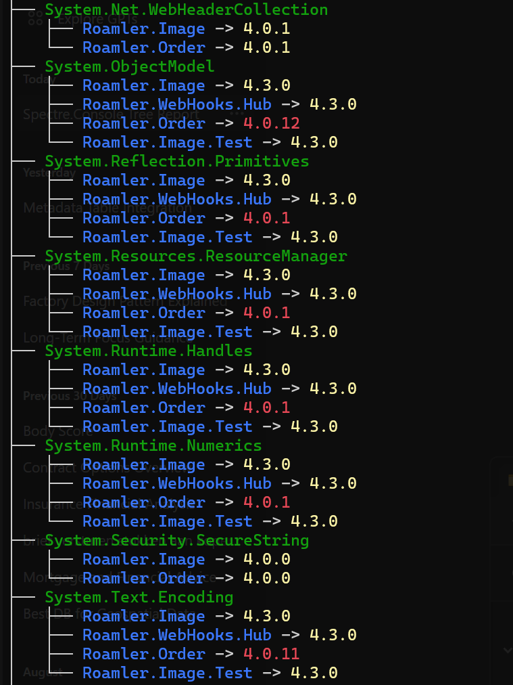

# PackageAnalyzer

PackageAnalyzer is a powerful .NET tool for dissecting solution dependencies, generating comprehensive package reports, and facilitating legacy-to-monolith migrations.

## 📖 The Story Behind PackageAnalyzer
At Roamler, we faced a common yet daunting challenge: modernizing our legacy microservices into a unified monolith. The obstacle? A maze of package dependencies and version conflicts across our .NET Framework projects. PackageAnalyzer was born in my weekend spare time from this need – a tool to map our dependency landscape, highlight version discrepancies, and guide our migration journey. What started as an in-house solution is now open-source, aiming to help others navigate similar modernization quests.

## 🚀 Features

- **Solution Analysis**: Scan and analyze packages.config files across all projects in a solution.
- **Dependency Mapping**: Identify and map both direct and transitive package dependencies.
- **Report Generation**: Create detailed reports on package usage and project dependencies.
- **Anomaly Detection**: Identify potential issues in package versioning and usage.

## 📊 Report Types

1. **Packages by Project**

    * Lists each project in your solution
    * For each project, shows all packages used and their versions
    * Helps you understand the dependency structure of individual projects
    * Useful for identifying which projects might need updating or consolidation

2. **Project by Packages Report**

    * Lists each package used across your solution
    * For each package, shows every project using it and the version used
    * Highlights version discrepancies as anomalies
    * Helps identify inconsistencies in package versions across projects
    * Useful for planning version alignment and identifying potential conflicts

3. **Anomalies Report**

    * Focuses on package version inconsistencies across projects
    * Lists project names and package versions that differ from the majority
    * Helps quickly identify areas that need attention for successful integration
    * Crucial for planning your monolith migration strategy

